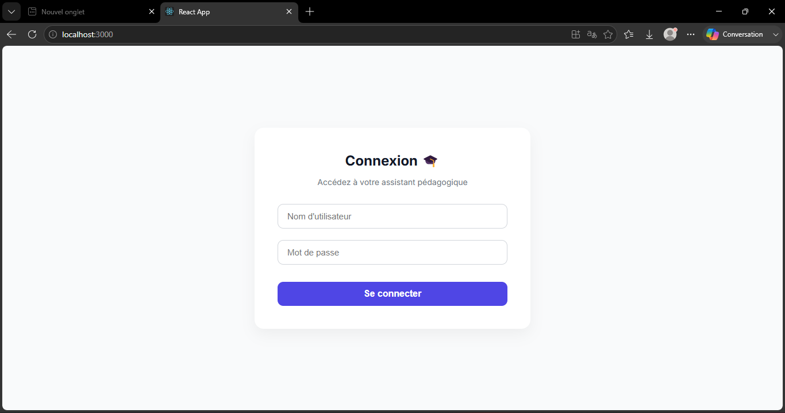
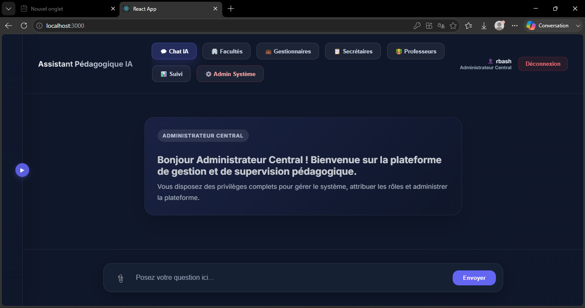
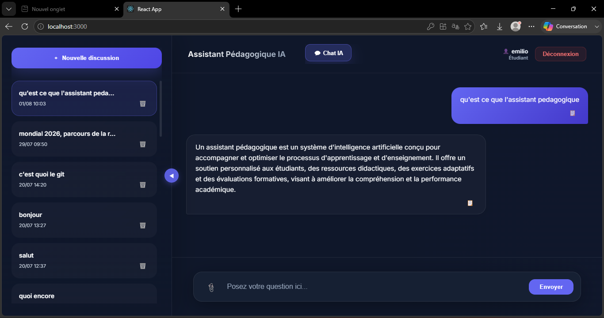
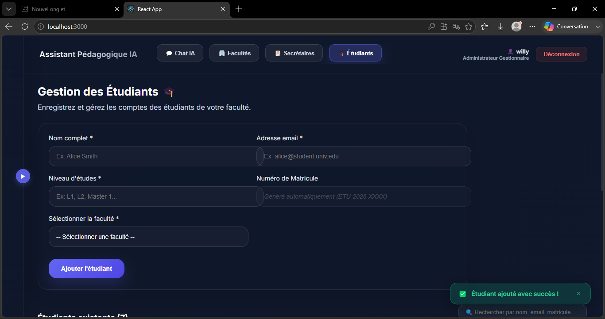

🎓 AI Educational Assistant


An AI-powered educational assistant designed to improve learning at William Booth University. This project helps students access academic information, interact with an intelligent chatbot, and manage educational resources through a modern web application.

## 📖 Overview

The AI Educational Assistant is a full-stack web application built as my final-year academic project in Computer Science and Artificial Intelligence.

It combines artificial intelligence, natural language processing (NLP), and modern web technologies to assist students with academic questions while providing administrators and professors with management tools.

---

## ✨ Features

### 👨‍🎓 Student
- Secure authentication
- AI-powered chatbot
- View courses and academic information
- Personalized conversations
- Chat history

### 👨‍🏫 Professor
- Upload course materials
- Manage educational content
- Interact with students

### 👨‍💼 Administrator
- User management
- Student management
- Professor management
- Faculty management
- Dashboard and statistics

---

## 🛠️ Tech Stack

### Backend
- Python
- Django
- Django REST Framework

### Frontend
- React.js
- JavaScript
- HTML
- CSS

### Database
- PostgreSQL

### AI & NLP
- spaCy
- Natural Language Processing (NLP)

### Tools
- Git
- GitHub
- VS Code

---

## 📂 Project Structure

```
Assistant-Pedagogique-IA/backend
│
├── backend/
├── chatbot-frontend/
├── docs/
├── screenshots/
└── README.md
```

---

## 🚀 Installation

### Clone the repository

```bash
git clone https://github.com/richardbashale-web/Assistant-Pedagogique-IA.git
```

### Backend

```bash
cd backend

python -m venv venv

source venv/bin/activate
# Windows
venv\Scripts\activate

pip install -r requirements.txt

python manage.py migrate

python manage.py runserver
```

### Frontend

```bash
cd frontend

npm install

npm start
```

---

## 📸 Application Screenshots

### Login Page



### Dashboard



### AI Chatbot



### Student Management



## 🎥 Project Demo

Watch the project demonstration here:

https://youtu.be/K3GZgKP5uDY?si=wU2bfbTYhL3E3dNq

## 🎯 Future Improvements

- Integration with Large Language Models (LLMs)
- Voice assistant
- Automatic quiz generation
- Recommendation system
- Mobile application

---

## 👨‍💻 Author

**Richard Bashale**

Computer Science & Artificial Intelligence Student

William Booth University

GitHub:
https://github.com/richardbashale-web

LinkedIn:
https://www.linkedin.com/in/richard-bashale-69028b3b1

---

## 📄 License

This project is developed for educational and research purposes.
